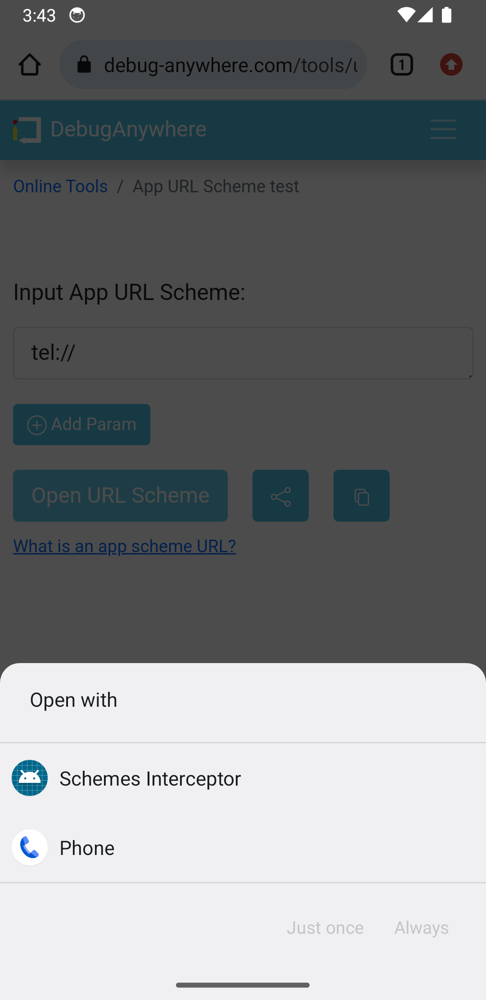

# Schemes Interceptor

English | [简体中文](README.md)

An Android blank application that intercepts multiple URL schemes based on configuration. A transparent `BlankActivity` receives a Scheme intent and immediately finishes; the settings screen lets users manage each Scheme interception switch.

## Screenshots



## Features

- Automatically generates URL Scheme `activity-alias` entries from `schemes.json`.
- Deduplicates identical Schemes and merges descriptions, for example `QQ / TIM`.
- Finishes the transparent interception Activity immediately after receiving an intent.
- Displays all Scheme entries in a RecyclerView settings screen.
- Shows other installed applications that handle each Scheme, excluding this application.
- Sorts entries alphabetically by Scheme.
- Searches and filters by Scheme or description.
- Enables or disables an individual Scheme alias with `SwitchCompat`.
- Provides a “Show installed apps only” filter.
- Includes basic internationalization: English is the default UI language and Simplified Chinese is provided; `desc` supports device-locale selection.
- Builds the APK automatically with GitHub Actions and uploads the build artifact.

## Scheme Configuration

The configuration file is:

`app/src/main/assets/schemes.json`

It contains a JSON array. Each entry must include a `scheme` field. Add a separate entry for each application, even when multiple applications use the same Scheme:

```json
[
  {
    "scheme": "mqq",
    "desc": {
      "zh-CN": "QQ",
      "en": "QQ"
    }
  },
  {
    "scheme": "mqq",
    "desc": {
      "zh-CN": "TIM",
      "en": "TIM"
    }
  },
  {
    "scheme": "weixin",
    "desc": "WeChat"
  }
]
```

### Localized `desc` Values

`desc` accepts either a string or a language-to-description object:

```json
"desc": "A fixed description"
```

A localized object can be used when different device languages should display different descriptions:

```json
"desc": {
  "zh-CN": "微信",
  "zh": "微信",
  "en": "WeChat"
}
```

For an object, descriptions are resolved in this order:

1. The full current language tag, such as `zh-CN`;
2. An underscore variant, such as `zh_CN`;
3. The current language code, such as `zh`;
4. `en` as the fallback.

Every localized object should provide an `en` value. If no usable description is found, the Scheme entry is still retained with an empty subtitle.

A Scheme must follow URL Scheme syntax: it starts with an ASCII letter and may be followed by letters, digits, `+`, `-`, or `.`.

## Building

### Requirements

- Android Studio or a Gradle installation
- JDK 17
- Android SDK 37
- Android Gradle Plugin 9.3.0

The project currently does not include the Gradle Wrapper. If Gradle is installed locally, run:

```bash
gradle build
```

Build outputs are written to:

```text
app/build/outputs/apk/
```

To install the debug APK:

```bash
gradle installDebug
```

## Automatic Manifest Generation

[gradle/scheme-manifest.gradle](gradle/scheme-manifest.gradle) runs before the main Manifest is processed and replaces:

- `<!-- SCHEME_QUERIES -->` with the generated `<queries>` intents;
- `<!-- SCHEME_ALIASES -->` with the generated `<activity-alias>` entries.

The source template is:

`app/src/main/AndroidManifest.xml`

Every alias targets `.BlankActivity`. The alias name is derived from the Scheme and a hash value. `SchemeManager` uses the same algorithm to locate the corresponding component and control its enabled state.

## Project Structure

```text
.
├── app/
│   └── src/main/
│       ├── assets/schemes.json
│       ├── java/moe/shuvi/schemesinterceptor/
│       │   ├── BlankActivity.java
│       │   ├── SchemeAdapter.java
│       │   ├── SchemeManager.java
│       │   └── SettingsActivity.java
│       └── res/
├── gradle/
│   └── scheme-manifest.gradle
└── .github/workflows/build.yml
```

## GitHub Actions

The workflow at `.github/workflows/build.yml` runs on pushes, pull requests, and manual dispatches. It:

1. Checks out the source code;
2. Sets up JDK 17;
3. Sets up Gradle 9.5.0;
4. Runs `gradle build`;
5. Uploads `app/build/outputs/apk/**/*.apk` as an artifact.

## License

This project is licensed under the [GNU General Public License v3.0](LICENSE) (GPL-3.0).

You may use, study, copy, modify, and distribute this project under the terms of GPLv3. Distribution of this project or derivative works must comply with the applicable GPLv3 requirements, including retaining copyright and license notices and providing the corresponding source code or a way to obtain it.

This project is provided “as is”, without warranty of any kind. See [LICENSE](LICENSE) for the complete license terms.
